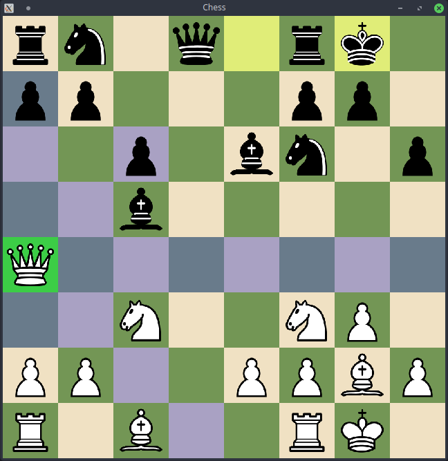

# Chess
Standard chess game for two players, developed in C++ using SFML graphics library.



## Installation
You need to have [SFML 2.6.2](https://www.sfml-dev.org/download/sfml/2.6.2/) library installed before compiling the project.

Compile the project by following these steps:

### 1. Clone the repository:

```bash
git clone https://github.com/Yurazast/Chess.git
cd Chess
```

### 2. Generate makefiles in the `build` directory:

```bash
cmake -B build
```

### 3. Build the project:

```bash
cmake --build build
```

After successful compilation, the executable file should be in the `build` directory.

## Usage

### Run the game

In order to properly run the game, you should place the executable file near the `resources` directory.

After that, run the application with the following command:

```bash
./Chess
```

### Keyboard Controls

- **Undo Move**: Press `Z` to undo the last move.

- **Redo Move**: Press `Y` to redo the last undone move.

- **Restart Game**: Press `R` to restart the game at any point.

### Command Line Arguments

The application supports the following optional arguments:

- `-f FEN` or `--fen FEN`: Load chess position from the FEN string.

- `-W WIDTH` or `--width WIDTH`: Set the window width.

- `-H HEIGHT` or `--height HEIGHT`: Set the window height.

- `-S WIDTHxHEIGHT` or `--size WIDTHxHEIGHT`: Set the window size.

- `-F` or `--fullscreen`: Launch in fullscreen mode.

#### Examples:

- Set the window width to 1024 and window height to 768:

```bash
./Chess --width 1024 --height 768
```

- Set the window size to 1024x768:

```bash
./Chess -S 1024x768
```

- Run the game in fullscreen mode:

```bash
./Chess --fullscreen
```

- Load chess position from the FEN string:

```bash
./Chess -f "rnbqkbnr/pppppppp/8/8/8/8/PPPPPPPP/RNBQKBNR w KQkq - 0 1"
```

Additionally, you can get full list of available options by running the application with the `-h` or `--help` argument:

```bash
./Chess --help
```
